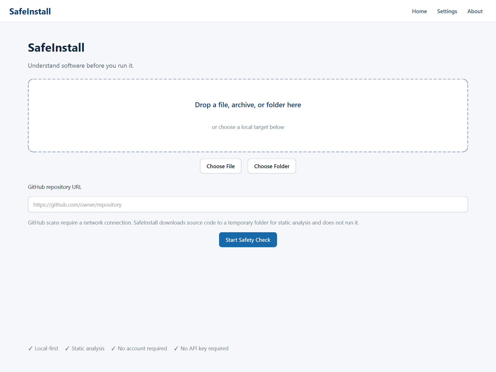
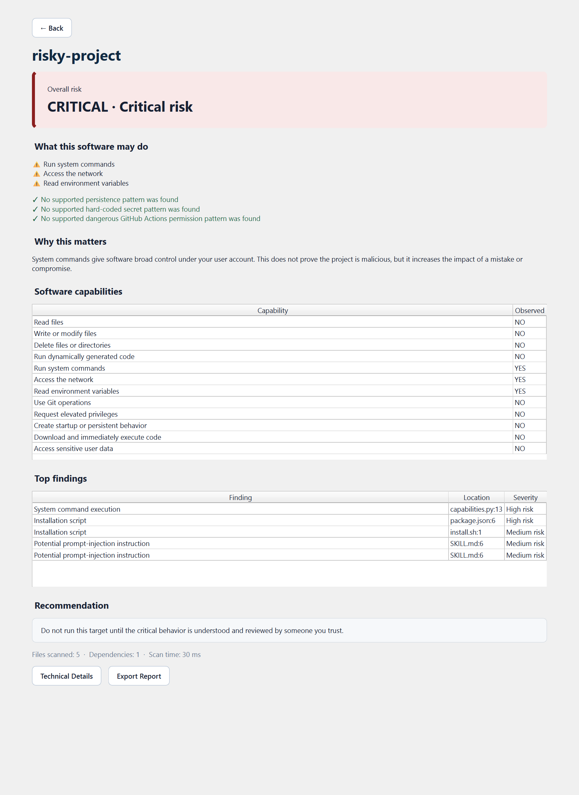
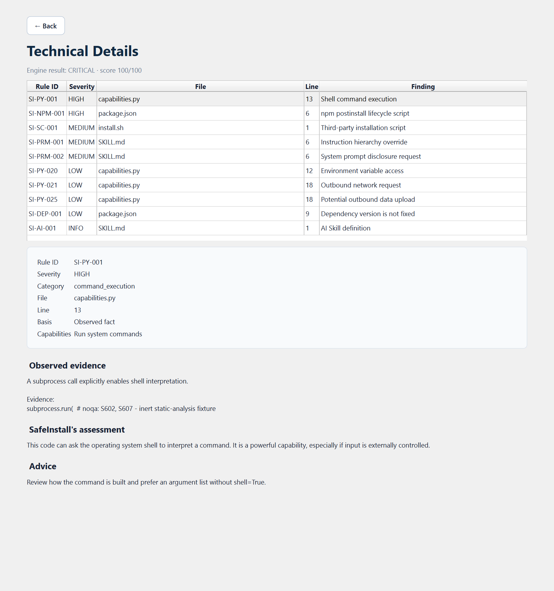

# SafeInstall

[English](README.md) | [简体中文](README.zh-CN.md)

> **Understand software before you run it.**

SafeInstall analyzes unknown scripts, open-source projects, AI plugins, Skills, and MCP
servers before you run them. It turns security-relevant code patterns into a report that
explains what a target may be able to do, where the evidence is, and what to review next.

SafeInstall is local-first and static by default. It never installs dependencies, imports a
target package, or executes scanned code. Core local scanning works without an OpenAI API key,
an account, or a network connection. Optional OpenAI analysis is off unless you pass `--ai` in
the CLI or explicitly enable it in desktop settings.

> [!IMPORTANT]
> SafeInstall provides risk analysis, not a malware-free guarantee. It does not replace
> antivirus software, sandboxing, code review, or trust in the software source.



## Download

**SafeInstall v0.2.0-alpha.1 is a public testing prerelease. Windows x64 is the recommended
alpha platform.**

Current public release: v0.2.0-alpha.1. The `main` branch is preparing 0.2.0a2, but no Alpha.2
Tag or Release exists yet. Use the [Releases page](https://github.com/wanhaoli376-lab/SafeInstall/releases)
to check what has actually been published.

### Windows x64

Download `SafeInstall-Windows-x64.zip` from the
[v0.2.0-alpha.1 release page](https://github.com/wanhaoli376-lab/SafeInstall/releases/tag/v0.2.0-alpha.1),
extract it, and open `SafeInstall/SafeInstall.exe`. Then drag in a file, folder, or supported
archive and click **Start Safety Check**.

No Python, pip, Git, account, or OpenAI API key is required for local scans. The alpha binary is
currently unsigned, so Windows SmartScreen may show a reputation warning. SafeInstall does not
recommend disabling Microsoft Defender or SmartScreen.

### macOS (experimental)

The current Alpha.1 release page also provides `SafeInstall-macOS-unsigned.zip`. This experimental
build supports **Apple Silicon (arm64) only** and does not support Intel Macs. It is not signed
with an Apple Developer ID and is not notarized, so macOS Gatekeeper may display a warning.
Windows remains the recommended platform for this alpha. Starting with the planned Alpha.2
release, the architecture-explicit asset name will be `SafeInstall-macOS-arm64-unsigned.zip`.

Verify either download with the release's `SHA256SUMS.txt`. `SBOM.json` is a CycloneDX inventory
of the constrained Python application dependency environment generated by the release metadata
job. It is not a binary- or operating-system-level inventory of either portable asset.

## Why SafeInstall

Commands such as `curl example.com/install.sh | bash` are compact but hide an important
fact: network content is downloaded and immediately interpreted by a shell. Likewise,
`subprocess.run(...)`, an npm `postinstall` hook, or an MCP filesystem tool may be legitimate
while still giving software meaningful control over a computer.

SafeInstall separates three things that security reports often blur together:

- **Facts:** the exact pattern, file, and line that were observed.
- **Inference:** a bounded capability or behavior-chain assessment.
- **Advice:** a practical next review step, without claiming the project is malicious.

## Features

- Local files and folders, ZIP/TAR archives, and public GitHub repositories
- Experimental English/Simplified Chinese desktop interface with drag-and-drop and background scans
- Python, shell, PowerShell, batch, and JavaScript/Node.js static scanners
- Dependency, install-script, Dockerfile, and GitHub Actions supply-chain checks
- Secret detection with centralized redaction; reports never intentionally print full values
- Skill, plugin manifest, MCP server, tool-definition, and prompt-injection checks
- Capability summaries for files, shell, network, environment, Git, privilege, and persistence
- Context-aware risk scoring, including environment-read plus unknown outbound POST behavior
- Human-readable terminal output plus stable JSON and GitHub-ready Markdown
- Strict YAML rule loading and an explicit scanner plugin registry
- Bounded, opt-in OpenAI explanations that receive only redacted findings and prompt excerpts

## How It Works

SafeInstall now includes an **experimental desktop interface** for selecting or dragging in a
file, supported archive, or folder, and for pasting a public GitHub repository URL.

```text
File / Folder / Archive / GitHub URL
                  ↓
             SafeInstall
                  ↓
       Risk overview + evidence
```

Local targets are analyzed on your computer. No account, telemetry, OpenAI account, or OpenAI API
key is required. AI explanations are off by default. The window remains responsive because it
calls the same `scan_target()` core as the CLI in a worker thread; it does not implement or weaken
the scanners itself.

The public alpha provides a portable Windows build and an experimental unsigned macOS build. See
[Desktop and packaging](docs/desktop.md) for platform status and the exact security boundary.

### Risk overview



### Technical evidence



## Developer Installation

SafeInstall has not been published to PyPI yet. Install it from a trusted clone:

```console
git clone https://github.com/wanhaoli376-lab/SafeInstall.git
cd SafeInstall
python -m pip install -e .
```

For development:

```console
python -m pip install -e ".[dev]"
```

To run the experimental desktop interface from source:

```console
python -m pip install -e ".[gui]"
safeinstall-gui
```

Optional AI support is a separate extra:

```console
python -m pip install -e ".[ai]"
```

## Quick Start

```console
safeinstall --help
safeinstall scan ./unknown-project
safeinstall scan ./download.zip
safeinstall scan https://github.com/OWNER/REPOSITORY
safeinstall scan ./unknown-project --format json
safeinstall scan ./unknown-project --format markdown
```

Nothing in the target is run by these commands. When Git is available, public repositories are
shallow-cloned with hooks and Git LFS smudging disabled. Otherwise SafeInstall downloads a
commit-pinned ZIP snapshot from fixed GitHub API/codeload hosts and passes it through the same safe
archive extractor. Either transport uses a restricted temporary directory that is removed after
the scan.

Local GUI scans work fully offline. GitHub URL scans require network access, but not Git, a GitHub
account, or an API token for public repositories. Anonymous GitHub API rate limits still apply.

### Example report

```text
SafeInstall Report
Target: example/project
Overall Risk: HIGH

What this software may do:
[!] Run commands on your computer
[!] Read environment variables
[!] Send outbound network requests

Primary reasons:
1. Environment data is read and can be sent to an unknown destination.
2. A subprocess call enables shell interpretation at installer.py:18.

Recommendation:
Review the installation path and network destination before running this project.

Static analysis only. These findings do not prove malicious intent.
```

Try the bundled fixtures:

```console
safeinstall scan ./examples/safe-project
safeinstall scan ./examples/risky-project
```

The risky example is inert: it contains unreachable fixture code, comments, and test strings
rather than a destructive command or working payload.

## Supported Targets

| Status | Targets and analysis |
|---|---|
| Supported | Local file/folder, ZIP, TAR/TAR.GZ, public GitHub repository |
| Supported | Python, shell, PowerShell, batch, JavaScript/Node.js |
| Supported | Python/npm manifests, lockfiles, install scripts, Dockerfiles, GitHub Actions |
| Supported | Skills, plugin manifests, MCP configurations/servers, prompt-like Markdown |
| Experimental | Desktop GUI, unsigned Windows and Apple Silicon-only macOS alpha builds, external YAML rules, trusted in-process scanner plugins, optional AI summaries |
| Planned | Deep binary formats (`.exe`, `.msi`, `.dmg`, `.pkg`), Go, Rust, APK, Office macros |
| Planned | Isolated execution sandbox, signed/notarized installers, automatic update checks, and binary analysis |

Unsupported or unrecognized content may be skipped. A clean report means that no supported
pattern was found; it does not prove safety.

The desktop app rejects known unsupported installer/binary formats instead of claiming they were
analyzed. A future `BinaryScanner` boundary is documented, but no empty or misleading binary
scanner is shipped.

## Optional AI Analysis

```console
safeinstall scan ./project --ai
```

AI mode reads `OPENAI_API_KEY` only from the process environment. The key is never placed in a
sample configuration or report. SafeInstall scans locally first, selects a bounded number of
findings and prompt files, redacts recognized secrets, and then sends those excerpts to the
OpenAI API. Target content is placed in the user-data portion of a fixed prompt and is always
treated as untrusted data.

**SafeInstall does not need an OpenAI API key for its core scanning features.** Installing only
the GUI extra also does not install the OpenAI SDK. If either the key or optional SDK is missing,
the desktop app explains that AI is unavailable and continues to scan locally.

Do not use `--ai` if code is not permitted to leave your environment. AI output is explanatory
and cannot lower the locally calculated risk or act as a security boundary. See
[OpenAI API maintenance](docs/openai-api-maintenance.md) and the
[security model](docs/security-model.md).

## Rules and Plugins

Declarative rules use a strict schema with an ID, name, description, severity, category,
language, pattern, explanation, recommendation, and capabilities. Invalid fields, duplicate
IDs, unsafe YAML tags, or oversized rule files are rejected. See
[Rule development](docs/rule-development.md).

Scanner plugins are trusted Python code and must be registered explicitly; simply placing code
inside a scanned repository never loads it. There is no online plugin store. See
[Plugin development](docs/plugin-development.md).

## Development

```console
python -m ruff check .
python -m ruff format --check .
python -m pytest
```

Desktop development and portable packaging:

```console
python -m pip install -e ".[dev,gui,gui-test,packaging]"
python -m pytest tests/gui
python -m PyInstaller --noconfirm --clean packaging/safeinstall.spec
```

The security suite covers archive traversal, symlink escape, secret redaction, malicious
filenames, Git URL injection, and AI prompt isolation.

## Roadmap

- **v0.1 alpha:** CLI, safe loaders, core language scanners, secrets, reports, and examples
- **v0.2 alpha:** experimental desktop GUI, drag-and-drop, local worker scans, bilingual results,
  report export, public portable builds, checksums, and a CycloneDX SBOM
- **v0.3:** richer Skill/plugin/MCP semantics and opt-in AI behavior-chain review
- **v0.4:** documented plugin SDK, broader community rule packs, and packaging hardening
- **v1.0:** stable rule/plugin APIs and supported CI integration

The v0.2 alpha codebase already includes early implementations of several later items; those APIs
remain experimental until their milestone is complete.

## Contributing and Security

Contributions are welcome for scanners, rules, tests, documentation, AI security checks, and
MCP analysis. Read [CONTRIBUTING.md](CONTRIBUTING.md) before changing security-sensitive
loaders, plugin execution, AI integration, or workflows.

Do not open a public issue for a vulnerability in SafeInstall. Follow
[SECURITY.md](SECURITY.md) instead. By participating, you agree to the
[Code of Conduct](CODE_OF_CONDUCT.md).

Alpha users can share sanitized usability feedback through
[GitHub Issues](https://github.com/wanhaoli376-lab/SafeInstall/issues/new/choose). Never attach
confidential source code, credentials, private reports, or unredacted secrets.

Licensed under the [MIT License](LICENSE).
