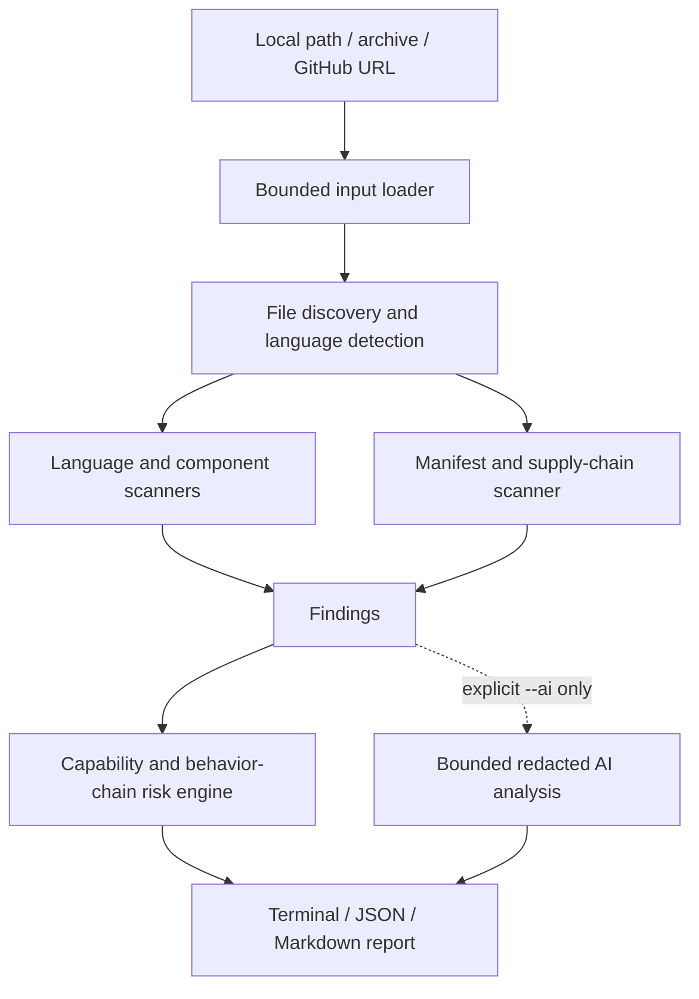

# Architecture

SafeInstall has one core job: turn untrusted files into evidence-backed findings without
executing the target. The public orchestration seam is `safeinstall.core.scan_target`; CLI and
future integrations should call it rather than assemble scanners independently.

## Modules and responsibilities

| Module | Responsibility | Must not do |
|---|---|---|
| `loaders` | Validate a local target, safely extract an archive, or shallow-clone GitHub into a temporary directory | Execute hooks, follow archive links, install dependencies |
| discovery | Read supported text files under size/count limits and assign a language | Follow symlinks or reparse points outside the target |
| `scanners` | Parse source/manifests and emit evidence-backed `Finding` values | Import target Python, invoke package managers, infer malicious intent |
| `rules` | Load strict data-only YAML and run bounded regular expressions | Accept Python objects, duplicate IDs, arbitrary fields, or executable rule code |
| `analysis` | Infer capabilities and a small set of explicit behavior chains | Claim full reachability or data-flow proof |
| `risk` | Combine severity, distinct categories/capabilities, and supported chains | Raise risk merely because many identical low findings exist |
| `report` | Explain facts, inference, limitations, and next actions; redact again at serialization | Print a full detected secret |
| `plugins` | Register caller-trusted scanner objects explicitly | Auto-import code found in the target |

## Data model

`SourceFile` is an immutable in-memory view produced after safe loading. A scanner returns one or
more `Finding` objects. Each finding has a stable rule ID, severity, category, confidence,
capabilities, explanation, recommendation, and at least one `Evidence` location. The risk engine
produces a `RiskAssessment`; the report combines it with target metadata, dependencies, and an
optional `AIAnalysisResult`.

The JSON schema is versioned independently as `ScanReport.schema_version`. Public model and
plugin stability is not promised before v1.0.

## Target lifecycle

1. Select exactly one loader from the input form.
2. Materialize the target inside a loader context and discover bounded source content.
3. Exit the loader context, which removes temporary clones/extractions.
4. Run local scanners and explicitly supplied plugins over in-memory `SourceFile` values.
5. Calculate local risk. This result exists whether or not AI is enabled.
6. If and only if `--ai` was supplied, send bounded redacted context to the API.
7. Render the same report model as terminal, JSON, or Markdown.

This lifecycle keeps target code and temporary content away from the optional network step and
gives all front ends one testable interface.
