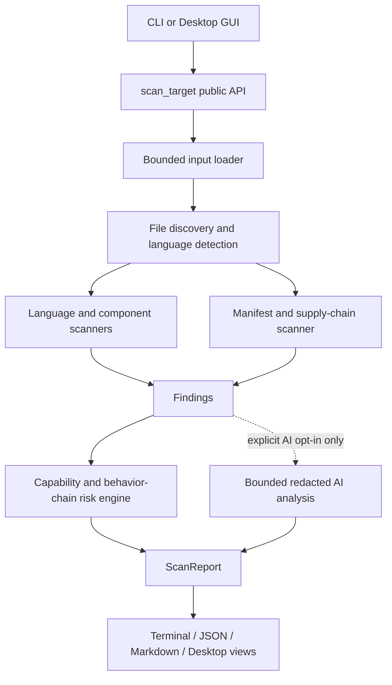

# Architecture

SafeInstall has one core job: turn untrusted files into evidence-backed findings without
executing the target. The public orchestration seam is `safeinstall.core.scan_target`; the CLI,
desktop GUI, and future integrations call it rather than assembling scanners independently.

## Modules and responsibilities

| Module | Responsibility | Must not do |
|---|---|---|
| `loaders` | Validate a local target, safely extract an archive, or materialize a public GitHub commit through shallow Git or a bounded HTTPS snapshot | Execute hooks, follow archive links, accept arbitrary download hosts, install dependencies |
| discovery | Read supported text files under size/count limits and assign a language | Follow symlinks or reparse points outside the target |
| `scanners` | Parse source/manifests and emit evidence-backed `Finding` values | Import target Python, invoke package managers, infer malicious intent |
| `rules` | Load strict data-only YAML and run bounded regular expressions | Accept Python objects, duplicate IDs, arbitrary fields, or executable rule code |
| `analysis` | Infer capabilities and a small set of explicit behavior chains | Claim full reachability or data-flow proof |
| `risk` | Combine severity, distinct categories/capabilities, and supported chains | Raise risk merely because many identical low findings exist |
| `report` | Explain facts, inference, limitations, and next actions; redact again at serialization | Print a full detected secret |
| `plugins` | Register caller-trusted scanner objects explicitly | Auto-import code found in the target |
| `gui` | Select one target, run `scan_target` on a worker thread, localize and present `ScanReport`, export through existing renderers | Scan files itself, block the UI thread, persist keys/secrets, or execute target content |

## Data model

`SourceFile` is an immutable in-memory view produced after safe loading. A scanner returns one or
more `Finding` objects. Each finding has a stable rule ID, severity, category, confidence,
capabilities, explanation, recommendation, and at least one `Evidence` location. The risk engine
produces a `RiskAssessment`; the report combines it with target metadata, dependencies, and an
optional `AIAnalysisResult`.

The JSON schema is versioned independently as `ScanReport.schema_version`. Public model and
plugin stability is not promised before v1.0.

Schema 1.1 adds `coverage`: `status` (`complete` or `partial`), the exact `skipped_count`, and up
to 100 `skipped_paths` with relative, redacted `path` and stable `reason` values. Reasons are
`file_too_large`, `undecodable_text`, `unreadable`, and `unsafe_path`. Directory traversal failures
and pruned links are represented as paths too; this count does not claim to count files inside
an unreadable directory. A larger count than the recorded list means the detail cap was reached.

Coverage concerns supported text formats outside the configured exclusions, not all bytes in
the project. Unsupported formats and ignored dependency/build directories remain outside scope.
The risk score is still based on observed findings, so consumers must check coverage before
interpreting it as a project-wide result. CLI status 0 means analysis completed (regardless of
risk level), 2 means loading/analysis failed, and 3 means a partial report was emitted.

## Target lifecycle

1. Select exactly one loader from the input form.
2. Materialize the target inside a loader context and discover bounded source content.
   Discovery also records bounded skip diagnostics. If no supported source was read, raise
   `NoScannableFilesError` before scanners, plugins, or optional AI run; do not create a report.
3. Exit the loader context, which removes temporary clones/extractions.
4. Run local scanners and explicitly supplied plugins over in-memory `SourceFile` values.
5. Calculate local risk. This result exists whether or not AI is enabled.
6. If and only if the CLI `--ai` flag or desktop AI opt-in is active, send bounded redacted context
   to the API.
7. Render the same report model as terminal, JSON, Markdown, or layered desktop views.

This lifecycle keeps target code and temporary content away from the optional network step and
gives all front ends one testable interface.

## Desktop boundary

`safeinstall.gui` is an optional package. `safeinstall-gui` uses a dependency-light launcher so a
CLI-only installation can still import and run the core without PySide6. Target classification
opens no files and uses no network. A drag/drop or picker action only prepares a target; scanning
starts after an explicit button click.

`ScanWorker` is a thin Qt adapter around `scan_target()`. It returns an immutable `ScanReport` or
an exception as queued signal data. It does not expose false percentage progress and does not
terminate a running parser thread unsafely. Overview and technical pages derive from the same
report; technical details preserve rule IDs, file/line evidence, confidence, explanations, and
recommendations. Report export calls `render_json()` or `render_markdown()` instead of duplicating
serialization.

Deep PE, Mach-O, and ELF analysis is planned behind a future binary scanner seam. Known installer
and binary extensions are currently rejected by the desktop target classifier, so the product
does not claim unsupported files were analyzed.
